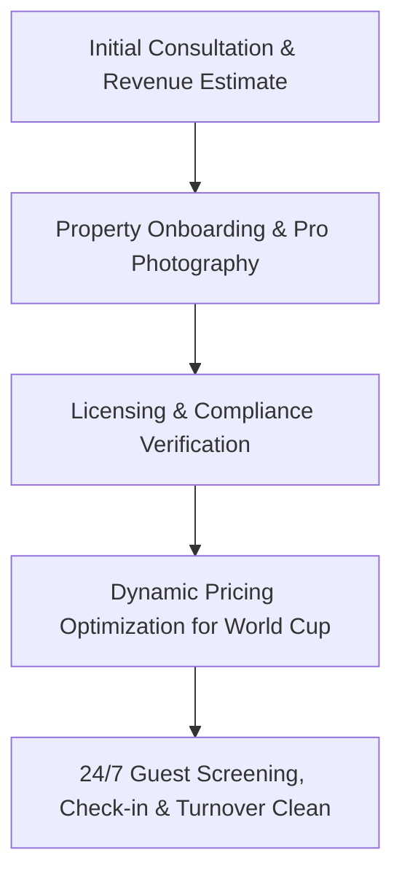

To delegate your Surrey condo during the summer World Cup period, you need a full-service short-term rental (STR) management company that services the Metro Vancouver/Surrey area.

### 1. Recommended Management Companies

These established local companies offer full-service delegation (listing creation, dynamic peak pricing, 24/7 guest screening, cleaning, and maintenance):

* **MasterHost:** Offers specialized Metro Vancouver and Surrey coverage. Their pricing tiers range from 12% to 18% of booking revenue with no fixed-term contracts, making them highly suitable for a seasonal summer-only setup.
* **HeartHomes:** Specializes in managed vacation rentals across Surrey and Vancouver. They focus heavily on listing optimization across multi-channels (Airbnb, Vrbo, Booking.com) and take care of local licensing compliance. Their standard fee is around 18%.
* **Guestable:** A premier full-service property management company in the Vancouver region that handles dynamic peak-event pricing (crucial for maximizing World Cup revenue) and professional photography.
* **Nestoria Estates / HostGenius:** Both handle comprehensive, hands-off short-term rental operations, professional cleaning coordination, and digital guest dashboards.

### 2. Standard Management Delegation Workflow

### 3. Key Points to Confirm Before Signing

* **Summer Flexibility:** Explicitly tell the company you are looking for a **seasonal/summer-only** contract, as some property managers prefer year-round arrangements.
* **Surrey Execution:** Confirm they have active, on-the-ground cleaning and emergency maintenance teams specifically operating within **Surrey Centre**, as delayed responses to guests can drop your listing's rank.
* **Fee Structure:** Standard management fees in Vancouver range between **12% and 20%** of gross rental revenue. Clarify if onboarding, cleaning setup, or photography require extra upfront costs.